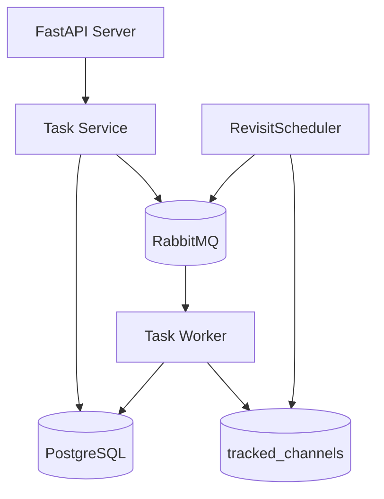
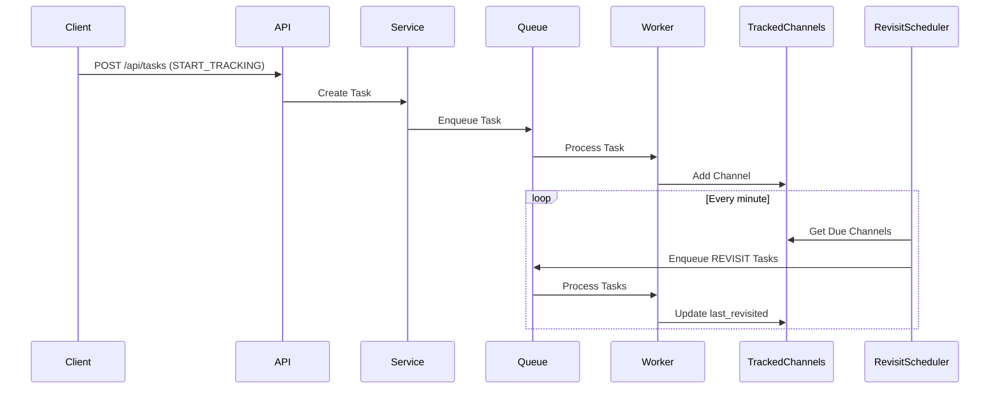
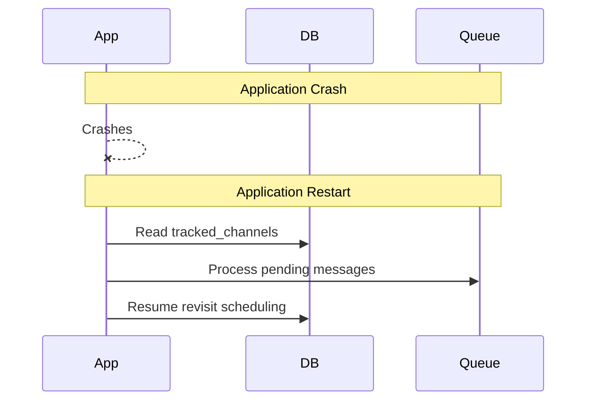
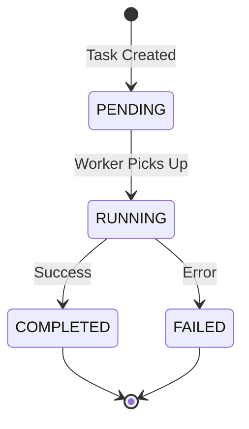

# Tasks Module Design Document

## Overview
The Tasks Module is designed to manage and execute asynchronous tasks for channel tracking operations. It provides a robust, crash-resilient system for task execution and periodic channel revisiting through a REST API interface. The system is designed to be horizontally scalable and recover gracefully from failures.

## Key Components

### Architecture Diagram


### Data Flow


## Crash Recovery and Resilience

### Task Lifecycle

1. RabbitMQ is only responsible for:
   - Holding tasks that need to be executed
   - Distributing tasks to available workers
   - It does NOT store or track task statuses

2. The PostgreSQL database is the source of truth for:
   - Task statuses
   - Task history
   - Task metadata
   - It's not just for logging, it's the primary way to track task state

The flow works like this:
1. When task is created:
   - Entry is created in DB with PENDING status
   - Task is enqueued in RabbitMQ

2. When worker picks up task:
   - It reads task message from RabbitMQ
   - Updates status to RUNNING in DB
   - Executes the task
   - Updates status to COMPLETED/FAILED in DB
   - RabbitMQ message is acknowledged and removed from queue

3. If service crashes during execution:
   - RabbitMQ will requeue unacknowledged messages
   - Worker will pick them up again
   - Worker will check DB status first to avoid duplicate execution
   - DB status is used to determine what happened and what to do next

So if you need to know task status - always check the database, never RabbitMQ. RabbitMQ is purely for task distribution and execution, while PostgreSQL maintains the authoritative record of task states and history.


### Application Crash Scenarios
1. **API Server Crashes**
   - No data loss - all state is in database
   - Can restart on any node
   - In-flight requests may fail

2. **Worker Crashes**
   - RabbitMQ retains unacknowledged messages
   - Tasks will be reprocessed when worker restarts
   - Task status tracks actual completion

3. **RevisitScheduler Crashes**
   - No data loss - scheduling info in tracked_channels table
   - Will resume checking due channels after restart
   - Missed intervals will be caught up naturally

4. **Database Connectivity Issues**
   - Tasks marked as failed
   - Service returns 503 error
   - Automatic retry for essential operations

### Crash Recovery Process


## Database Schema

### Tasks Table
- `id`: Integer (Primary Key)
- `message_id`: String (Unique)
- `task_type`: Enum (START_TRACKING, REVISIT_CHANNEL)
- `channel_name`: String
- `status`: Enum (PENDING, RUNNING, COMPLETED, FAILED)
- `created_at`: Timestamp
- `started_at`: Timestamp (Nullable)
- `completed_at`: Timestamp (Nullable)
- `error_message`: String (Nullable)

### Tracked Channels Table
- `id`: Integer (Primary Key)
- `channel_id`: Integer (Unique)
- `revisiting`: Boolean
- `last_revisited`: Timestamp (Nullable)
- `created_at`: Timestamp

## API Specification

### Endpoints
1. Create Task
   ```http
   POST /api/tasks
   {
     "task_type": "START_TRACKING",
     "channel_name": "example_channel"
   }
   ```

2. Get Task Status
   ```http
   GET /api/tasks/{task_id}
   ```

3. List Tasks
   ```http
   GET /api/tasks?status={status}&channel_name={channel_name}
   ```

### Task States


## Component Details

### Task Service
- Task creation and management
- Database operations coordination
- Queue interaction
- Error handling and status tracking

### RevisitScheduler
- Periodic checking of tracked channels
- Interval-based scheduling
- Last visit time tracking
- Automatic catch-up for missed intervals

### Worker Process
- Task execution
- Channel tracking management
- Status updates
- Automatic retry handling

## Scaling and Deployment

### Horizontal Scaling
- Multiple API instances possible
- Worker nodes can be scaled independently
- RevisitScheduler runs as singleton
- Database is single source of truth

### Deployment Requirements
- PostgreSQL database
- RabbitMQ cluster
- Container orchestration (e.g., Kubernetes)

## Error Handling
1. Task Creation Failures
   - Database errors
   - Queue errors
   - Invalid input validation

2. Task Execution Failures
   - Connection issues
   - Processing errors
   - State conflicts

3. System Failures
   - Component crashes
   - Network issues
   - Resource exhaustion

## Configuration
- Database connection
- RabbitMQ settings
- Worker pool size
- Revisit intervals
- API settings

## Future Enhancements
1. Task Retry Policies
2. Priority Queuing
3. Channel Health Monitoring
4. Advanced Scheduling Patterns
5. Performance Metrics
6. Admin Interface
